# Architecture — F1 Telemetry Analytics Dashboard

## Component Diagram (Mermaid)

> Renders automatically on GitHub. If your viewer doesn't support Mermaid,
> see the ASCII version below.

```mermaid
flowchart TD
    subgraph UI["app.py — Streamlit UI"]
        A1[Sidebar: Season / GP / Session]
        A2[Tab 1: Fastest Lap Analysis]
        A3[Tab 2: Average Speed Analysis]
        A4[Tab 3: Driver Comparison]
        A5[Tab 4: Lap Times Overview]
    end

    subgraph Logic["utils/analysis.py — Business Logic"]
        B1[Pure functions\nformat_timedelta, format_speed,\ncompute_average_speed_from_telemetry,\ncompute_delta_time, build_lap_summary,\n_filter_valid_laps]
        B2[Orchestration functions\nget_fastest_lap, summarize_lap,\ncompare_two_drivers,\nget_all_drivers_fastest_summary]
    end

    subgraph Data["utils/data_loader.py — External API Access"]
        C1[setup_cache]
        C2[get_event_schedule / get_event_names]
        C3[load_session]
        C4[get_driver_list / get_driver_full_name]
        C5[DataLoadError — normalized exception]
    end

    subgraph Viz["utils/charts.py — Plotly Figure Builders"]
        D1[plot_speed_trace / plot_speed_comparison]
        D2[plot_delta_time]
        D3[plot_throttle_brake / plot_gear_map]
        D4[plot_avg_speed_bar / plot_top_speed_bar / plot_lap_time_ranking]
        D5[plot_lap_times_over_race]
    end

    subgraph Support["Supporting Modules"]
        E1[config.py — constants & theme]
        E2[utils/logger.py — centralized logging]
        E3[utils/styling.py — CSS + footer]
    end

    F[(FastF1 Library\nOfficial F1 Timing API)]

    A1 --> C2
    A1 --> C3
    A2 --> B2
    A3 --> B2
    A4 --> B2
    A5 --> C4
    B2 --> B1
    B2 --> C3
    B2 --> C4
    C3 --> F
    C2 --> F
    C5 -.->|shown as friendly st.error| UI
    A2 --> D1 & D3
    A3 --> D4
    A4 --> D1 & D2
    A5 --> D5
    UI --> E3
    Logic --> E2
    Data --> E2
    Data --> E1
    Viz --> E1
```



## ASCII Fallback

```
┌─────────────────────────────────────────────────────────────────┐
│  app.py  (Streamlit UI layer)                                    │
│  Sidebar: Season → Grand Prix → Session Type → Load Session       │
│  Tabs: Fastest Lap | Average Speed | Driver Comparison | Lap Times│
└───────────────────────────┬───────────────────────────────────┘
                             │ calls
        ┌────────────────────┼────────────────────┐
        ▼                    ▼                    ▼
┌────────────────┐  ┌───────────────────┐  ┌──────────────────┐
│ data_loader.py  │  │   analysis.py      │  │   charts.py       │
│ FastF1 session  │  │  Pure functions:    │  │  Plotly figure    │
│ loading,        │  │   time-weighted avg │  │  builders,         │
│ schedules,      │  │   speed, delta time, │  │  defensive on      │
│ DataLoadError   │  │   lap-validity filter│  │  empty data        │
│ (normalizes all │  │  Orchestration:      │  └──────────────────┘
│  FastF1 errors) │  │   fastest lap, compare│
└────────┬────────┘  │   drivers, leaderboard│
         │            └──────────────────────┘
         ▼
┌─────────────────┐   ┌─────────────┐   ┌──────────────┐
│  fastf1 library  │   │  logger.py  │   │  styling.py  │
│  (official F1     │   │  centralized│   │  CSS theme +  │
│   timing API)      │   │  logging     │   │  footer       │
└─────────────────┘   └─────────────┘   └──────────────┘
```

## Data Flow (Request Lifecycle)

1. User picks **Season → Grand Prix → Session Type** in the sidebar and
   clicks **Load Session**.
2. `app.py` calls `data_loader.load_session()`, which calls FastF1's
   `get_session()` + `.load()`. Any failure is normalized into a single
   `DataLoadError` with a friendly message; the full exception is logged.
3. The resulting FastF1 `Session` object is cached in `st.session_state`
   (`@st.cache_resource`) so switching tabs doesn't re-download data.
4. Each tab calls into `analysis.py`'s orchestration functions
   (`summarize_lap`, `compare_two_drivers`, etc.), which fetch a lap +
   its telemetry once, then delegate the actual computation to pure,
   independently-tested functions.
5. Analysis results (a `LapSummary` dataclass, a delta-time DataFrame,
   etc.) are passed to `charts.py`, which builds a Plotly `Figure` —
   rendering a "no data available" placeholder instead of crashing if
   the data turns out to be empty or malformed.
6. `app.py` renders the figure via `st.plotly_chart()`.

## Why this shape?

- **One-way dependency flow.** UI → business logic → external API. No
  layer reaches back up into the layer above it, which is what makes
  `analysis.py` and `charts.py` testable without a live network call.
- **One exception type at the UI boundary.** `data_loader.py` is the
  only place that needs to know about FastF1's various possible
  failure modes; everywhere else just handles `DataLoadError`.
- **Pure vs. orchestration split inside `analysis.py`.** This is the
  single decision that makes the ~40-test suite possible without
  network access — the logic worth testing has no external dependency
  to mock.
